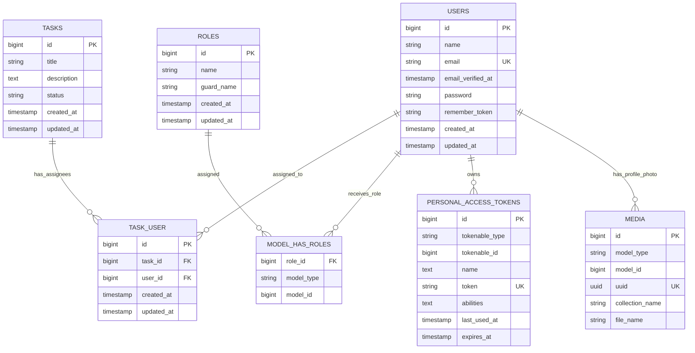

# Database Schema Documentation

Backend project: `task-manager-backend`

Default database connection from `.env.example`: `sqlite`

Important database-related settings:

- `DB_CONNECTION=sqlite`
- `SESSION_DRIVER=database`
- `QUEUE_CONNECTION=database`
- `CACHE_STORE=database`

This means the database stores app data, login sessions, queue jobs, cache records, Sanctum API tokens, Spatie roles, and media records.

## Main App Tables

### `users`

Migration: `database/migrations/0001_01_01_000000_create_users_table.php`

Model: `App\Models\User`

Purpose:

- Stores admin and employee accounts.
- Used for login, profile data, roles, task assignment, and profile photos.

Columns:

| Column | Type | Nullable | Key / Index | Notes |
| --- | --- | --- | --- | --- |
| `id` | big integer | No | Primary key | Auto-increment user id |
| `name` | string | No | | User display name |
| `email` | string | No | Unique | Login email |
| `email_verified_at` | timestamp | Yes | | Email verification timestamp |
| `password` | string | No | | Hashed password |
| `remember_token` | string | Yes | | Laravel remember token |
| `created_at` | timestamp | Yes | | Created timestamp |
| `updated_at` | timestamp | Yes | | Last updated timestamp |

Model behavior:

- Fillable fields: `name`, `email`, `password`
- Hidden fields: `password`, `remember_token`
- Casts:
  - `email_verified_at` as datetime
  - `password` as hashed
- Uses:
  - `HasApiTokens` for Laravel Sanctum
  - `HasRoles` for Spatie roles
  - `InteractsWithMedia` for profile photos

Relationships:

- `users` belongs to many `tasks` through `task_user`.
- `users` has roles through Spatie's `model_has_roles` table.
- `users` has API tokens through Sanctum's `personal_access_tokens` table.
- `users` can have profile photo media through Spatie Media Library's `media` table.

### `tasks`

Migration: `database/migrations/2026_05_07_050726_create_tasks_table.php`

Model: `App\Models\Task`

Purpose:

- Stores tasks created by admins.
- Each task can be assigned to one or more employees.

Columns:

| Column | Type | Nullable | Key / Index | Notes |
| --- | --- | --- | --- | --- |
| `id` | big integer | No | Primary key | Auto-increment task id |
| `title` | string | No | | Task title |
| `description` | text | Yes | | Task details |
| `status` | string | No | | Defaults to `pending` |
| `created_at` | timestamp | Yes | | Created timestamp |
| `updated_at` | timestamp | Yes | | Last updated timestamp |

Expected statuses from controllers:

- `pending`
- `in_progress`
- `completed`

Note: The database itself stores `status` as a plain string, so valid statuses are enforced by controller validation, not a database enum/check constraint.

Model behavior:

- Fillable fields: `title`, `description`, `status`

Relationships:

- `tasks` belongs to many `users` through `task_user`.

### `task_user`

Migration: `database/migrations/2026_05_07_120626_create_task_user_table.php`

Purpose:

- Pivot table for the many-to-many relationship between tasks and users.
- Stores which employees are assigned to which tasks.

Columns:

| Column | Type | Nullable | Key / Index | Notes |
| --- | --- | --- | --- | --- |
| `id` | big integer | No | Primary key | Auto-increment pivot id |
| `task_id` | big integer | No | Foreign key | References `tasks.id`; cascades on delete |
| `user_id` | big integer | No | Foreign key | References `users.id`; cascades on delete |
| `created_at` | timestamp | Yes | | Created timestamp |
| `updated_at` | timestamp | Yes | | Last updated timestamp |

Relationship behavior:

- When a task is deleted, related `task_user` rows are deleted automatically.
- When a user is deleted, related `task_user` rows are deleted automatically.
- The controllers also manually detach users before deleting a task.

Important note:

- There is no unique constraint on `(task_id, user_id)`. Laravel's `sync()` avoids duplicates during normal app usage, but the database does not prevent duplicate rows if inserted manually.

## Authentication and Authorization Tables

### `personal_access_tokens`

Migration: `database/migrations/2026_05_05_031523_create_personal_access_tokens_table.php`

Package: Laravel Sanctum

Purpose:

- Stores bearer tokens created during login/register.
- React sends these tokens in the `Authorization: Bearer {token}` header.

Columns:

| Column | Type | Nullable | Key / Index | Notes |
| --- | --- | --- | --- | --- |
| `id` | big integer | No | Primary key | Auto-increment token id |
| `tokenable_type` | string | No | Indexed with `tokenable_id` | Usually `App\Models\User` |
| `tokenable_id` | big integer | No | Indexed with `tokenable_type` | User id |
| `name` | text | No | | Token name, currently `auth_token` |
| `token` | string(64) | No | Unique | Hashed token value |
| `abilities` | text | Yes | | Token permissions/abilities |
| `last_used_at` | timestamp | Yes | | Updated when token is used |
| `expires_at` | timestamp | Yes | Indexed | Expiration time if configured |
| `created_at` | timestamp | Yes | | Created timestamp |
| `updated_at` | timestamp | Yes | | Last updated timestamp |

Current app behavior:

- `POST /login` creates a token.
- `POST /register` creates a token.
- `POST /logout` deletes the current token, but the React app currently clears `localStorage` without calling this endpoint.

### `roles`

Migration: `database/migrations/2026_05_08_063255_create_permission_tables.php`

Package: Spatie Laravel Permission

Purpose:

- Stores role names used by middleware and frontend redirects.

Columns:

| Column | Type | Nullable | Key / Index | Notes |
| --- | --- | --- | --- | --- |
| `id` | big integer | No | Primary key | Auto-increment role id |
| `name` | string | No | Unique with `guard_name` | Example roles: `admin`, `employee` |
| `guard_name` | string | No | Unique with `name` | Usually `web` |
| `created_at` | timestamp | Yes | | Created timestamp |
| `updated_at` | timestamp | Yes | | Last updated timestamp |

Expected role rows:

| Role | Used For |
| --- | --- |
| `admin` | Access to task management and user management routes |
| `employee` | Access to assigned task dashboard and status updates |

Important note:

- The current `DatabaseSeeder.php` only creates a test user and does not create `admin` or `employee` roles.
- Because controllers call `assignRole('employee')`, the `employee` role must exist before registering or creating employees.
- Because routes use `role:admin` and `role:employee`, both roles must exist for role-based access to work.

### `permissions`

Migration: `database/migrations/2026_05_08_063255_create_permission_tables.php`

Package: Spatie Laravel Permission

Purpose:

- Stores named permissions.
- This app currently uses roles directly and does not define custom permissions in the visible code.

Columns:

| Column | Type | Nullable | Key / Index | Notes |
| --- | --- | --- | --- | --- |
| `id` | big integer | No | Primary key | Auto-increment permission id |
| `name` | string | No | Unique with `guard_name` | Permission name |
| `guard_name` | string | No | Unique with `name` | Usually `web` |
| `created_at` | timestamp | Yes | | Created timestamp |
| `updated_at` | timestamp | Yes | | Last updated timestamp |

### `model_has_roles`

Migration: `database/migrations/2026_05_08_063255_create_permission_tables.php`

Package: Spatie Laravel Permission

Purpose:

- Polymorphic pivot table connecting users to roles.

Columns:

| Column | Type | Nullable | Key / Index | Notes |
| --- | --- | --- | --- | --- |
| `role_id` | big integer | No | Primary key part, foreign key | References `roles.id`; cascades on delete |
| `model_type` | string | No | Primary key part | Usually `App\Models\User` |
| `model_id` | big integer | No | Primary key part, indexed | User id |

How it is used:

- `UserController@store` assigns `employee`.
- `AuthController@register` assigns `employee`.
- Middleware checks `role:admin` and `role:employee`.
- React reads `user.roles[0].name` after login to decide the dashboard route.

### `model_has_permissions`

Migration: `database/migrations/2026_05_08_063255_create_permission_tables.php`

Package: Spatie Laravel Permission

Purpose:

- Polymorphic pivot table connecting models directly to permissions.
- Not directly used in the current visible app code.

Columns:

| Column | Type | Nullable | Key / Index | Notes |
| --- | --- | --- | --- | --- |
| `permission_id` | big integer | No | Primary key part, foreign key | References `permissions.id`; cascades on delete |
| `model_type` | string | No | Primary key part | Model class name |
| `model_id` | big integer | No | Primary key part, indexed | Model id |

### `role_has_permissions`

Migration: `database/migrations/2026_05_08_063255_create_permission_tables.php`

Package: Spatie Laravel Permission

Purpose:

- Pivot table connecting roles to permissions.
- Not directly used in the current visible app code.

Columns:

| Column | Type | Nullable | Key / Index | Notes |
| --- | --- | --- | --- | --- |
| `permission_id` | big integer | No | Primary key part, foreign key | References `permissions.id`; cascades on delete |
| `role_id` | big integer | No | Primary key part, foreign key | References `roles.id`; cascades on delete |

## Profile Photo / Media Table

### `media`

Migration: `database/migrations/2026_05_08_153157_create_media_table.php`

Package: Spatie Media Library

Purpose:

- Stores metadata for uploaded profile photos.
- Actual files are stored on disk; this table stores file information and polymorphic ownership.

Columns:

| Column | Type | Nullable | Key / Index | Notes |
| --- | --- | --- | --- | --- |
| `id` | big integer | No | Primary key | Auto-increment media id |
| `model_type` | string | No | Indexed with `model_id` | Usually `App\Models\User` |
| `model_id` | big integer | No | Indexed with `model_type` | User id |
| `uuid` | uuid | Yes | Unique | Media UUID |
| `collection_name` | string | No | | Current app uses `profile_photo` |
| `name` | string | No | | Media name |
| `file_name` | string | No | | Stored filename |
| `mime_type` | string | Yes | | File MIME type |
| `disk` | string | No | | Storage disk |
| `conversions_disk` | string | Yes | | Disk for conversions |
| `size` | unsigned big integer | No | | File size in bytes |
| `manipulations` | json | No | | Media Library metadata |
| `custom_properties` | json | No | | Media Library metadata |
| `generated_conversions` | json | No | | Media Library metadata |
| `responsive_images` | json | No | | Media Library metadata |
| `order_column` | unsigned integer | Yes | Indexed | Sort order |
| `created_at` | timestamp | Yes | | Created timestamp |
| `updated_at` | timestamp | Yes | | Last updated timestamp |

Current app behavior:

- `POST /profile/{id}/photo` validates one image up to 2048 KB.
- Existing `profile_photo` media for the user is cleared.
- The new photo is stored in the `profile_photo` collection.
- `GET /profile/{id}` returns `photo_url` from the first media item in that collection.

## Laravel Framework Tables

### `password_reset_tokens`

Migration: `database/migrations/0001_01_01_000000_create_users_table.php`

Purpose:

- Stores password reset tokens.
- Not currently used by the visible React app.

Columns:

| Column | Type | Nullable | Key / Index | Notes |
| --- | --- | --- | --- | --- |
| `email` | string | No | Primary key | User email |
| `token` | string | No | | Reset token |
| `created_at` | timestamp | Yes | | Created timestamp |

### `sessions`

Migration: `database/migrations/0001_01_01_000000_create_users_table.php`

Purpose:

- Stores Laravel session data because `SESSION_DRIVER=database`.
- API auth in this app mainly uses Sanctum bearer tokens, not session auth from React.

Columns:

| Column | Type | Nullable | Key / Index | Notes |
| --- | --- | --- | --- | --- |
| `id` | string | No | Primary key | Session id |
| `user_id` | big integer | Yes | Indexed | Authenticated user id if session-authenticated |
| `ip_address` | string(45) | Yes | | Client IP address |
| `user_agent` | text | Yes | | Browser user agent |
| `payload` | long text | No | | Serialized session payload |
| `last_activity` | integer | No | Indexed | Last activity timestamp |

### `cache`

Migration: `database/migrations/0001_01_01_000001_create_cache_table.php`

Purpose:

- Stores Laravel cache values because `CACHE_STORE=database`.

Columns:

| Column | Type | Nullable | Key / Index | Notes |
| --- | --- | --- | --- | --- |
| `key` | string | No | Primary key | Cache key |
| `value` | medium text | No | | Cached value |
| `expiration` | big integer | No | Indexed | Expiration timestamp |

### `cache_locks`

Migration: `database/migrations/0001_01_01_000001_create_cache_table.php`

Purpose:

- Stores database-backed cache locks.

Columns:

| Column | Type | Nullable | Key / Index | Notes |
| --- | --- | --- | --- | --- |
| `key` | string | No | Primary key | Lock key |
| `owner` | string | No | | Lock owner |
| `expiration` | big integer | No | Indexed | Expiration timestamp |

### `jobs`

Migration: `database/migrations/0001_01_01_000002_create_jobs_table.php`

Purpose:

- Stores queued jobs because `QUEUE_CONNECTION=database`.

Columns:

| Column | Type | Nullable | Key / Index | Notes |
| --- | --- | --- | --- | --- |
| `id` | big integer | No | Primary key | Auto-increment job id |
| `queue` | string | No | Indexed | Queue name |
| `payload` | long text | No | | Serialized job payload |
| `attempts` | unsigned small integer | No | | Attempt count |
| `reserved_at` | unsigned integer | Yes | | Reservation timestamp |
| `available_at` | unsigned integer | No | | Availability timestamp |
| `created_at` | unsigned integer | No | | Creation timestamp |

### `job_batches`

Migration: `database/migrations/0001_01_01_000002_create_jobs_table.php`

Purpose:

- Stores metadata for Laravel batch jobs.

Columns:

| Column | Type | Nullable | Key / Index | Notes |
| --- | --- | --- | --- | --- |
| `id` | string | No | Primary key | Batch id |
| `name` | string | No | | Batch name |
| `total_jobs` | integer | No | | Total job count |
| `pending_jobs` | integer | No | | Pending job count |
| `failed_jobs` | integer | No | | Failed job count |
| `failed_job_ids` | long text | No | | Failed job ids |
| `options` | medium text | Yes | | Batch options |
| `cancelled_at` | integer | Yes | | Cancellation timestamp |
| `created_at` | integer | No | | Creation timestamp |
| `finished_at` | integer | Yes | | Finished timestamp |

### `failed_jobs`

Migration: `database/migrations/0001_01_01_000002_create_jobs_table.php`

Purpose:

- Stores failed queue jobs.

Columns:

| Column | Type | Nullable | Key / Index | Notes |
| --- | --- | --- | --- | --- |
| `id` | big integer | No | Primary key | Auto-increment failed job id |
| `uuid` | string | No | Unique | Failed job UUID |
| `connection` | text | No | | Queue connection |
| `queue` | text | No | | Queue name |
| `payload` | long text | No | | Serialized job payload |
| `exception` | long text | No | | Exception details |
| `failed_at` | timestamp | No | | Defaults to current timestamp |

## Relationship Diagram

## Data Flow by Feature

### Login

1. User submits login credentials.
2. `users` is queried by email.
3. Password is checked against `users.password`.
4. A row is inserted into `personal_access_tokens`.
5. User roles are loaded through `model_has_roles` and `roles`.
6. React stores the returned token and role.

### Admin Creates Employee

1. A row is inserted into `users`.
2. The password is hashed.
3. The `employee` role is attached through `model_has_roles`.

### Admin Creates Task

1. A row is inserted into `tasks`.
2. Selected employee ids are synced into `task_user`.
3. Admin task list reloads with `tasks` and related `users`.

### Employee Updates Task Status

1. Employee clicks `Start Task` or `Complete Task`.
2. The backend confirms the authenticated employee is assigned to the task.
3. The matching `tasks.id` row is updated.
4. `tasks.status` becomes `in_progress` or `completed`.
5. Employee task list reloads through the `users` to `tasks` relationship.

### Profile Photo Upload

1. Existing `media` rows for the user's `profile_photo` collection are cleared.
2. A new `media` row is inserted.
3. The uploaded file is stored on disk.
4. `GET /profile/{id}` returns the generated `photo_url`.

## Seeder Notes

Current seeder: `database/seeders/DatabaseSeeder.php`

Current seeded data:

- One user:
  - `name`: `Test User`
  - `email`: `test@example.com`

Current seeder gaps:

- It does not create `admin` or `employee` roles.
- It does not assign a role to the test user.
- It does not create the default frontend login user `admin@test.com`.

Suggested minimum seed data for this app:

| Table | Suggested Rows |
| --- | --- |
| `roles` | `admin`, `employee` |
| `users` | One admin user |
| `model_has_roles` | Assign admin role to admin user |

## Schema Notes and Potential Improvements

- Add a unique index on `task_user(task_id, user_id)` to prevent duplicate assignments at the database level.
- Add status validation at the database level if your database supports check constraints.
- Make `tasks.status` consistent across controllers; create and status update validate allowed statuses, but full task update currently accepts any string.
- Add seeders for `admin` and `employee` roles so `assignRole('employee')` works after a fresh migration.
