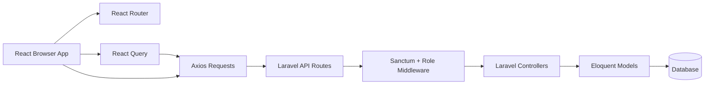
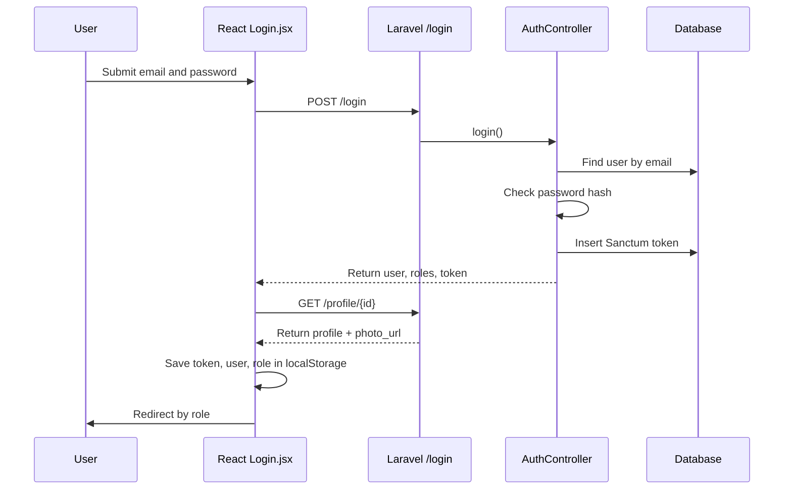
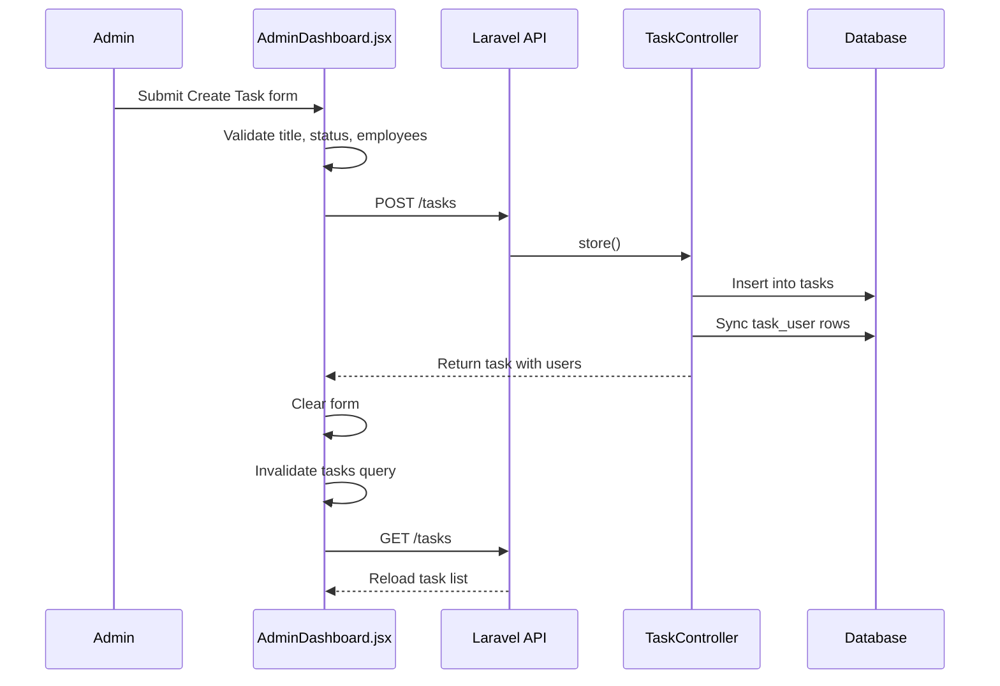
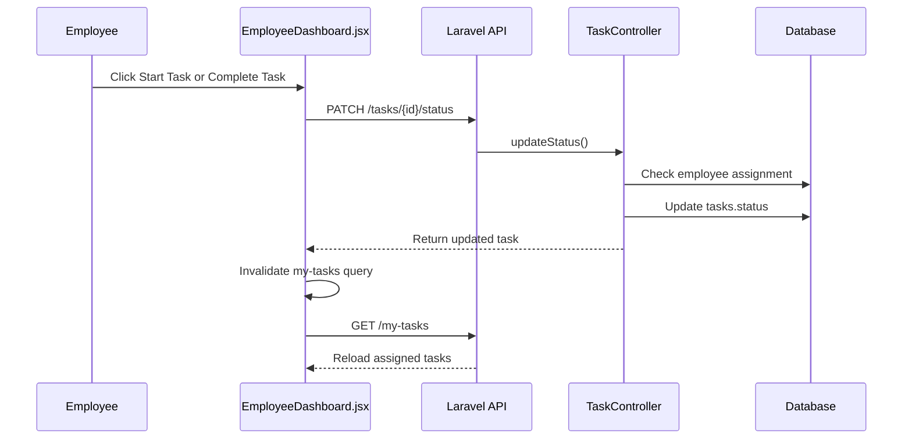
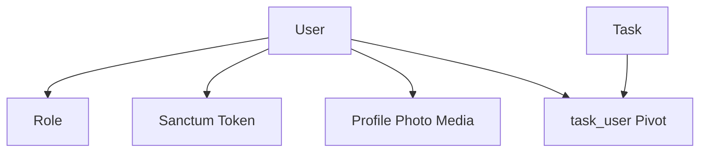
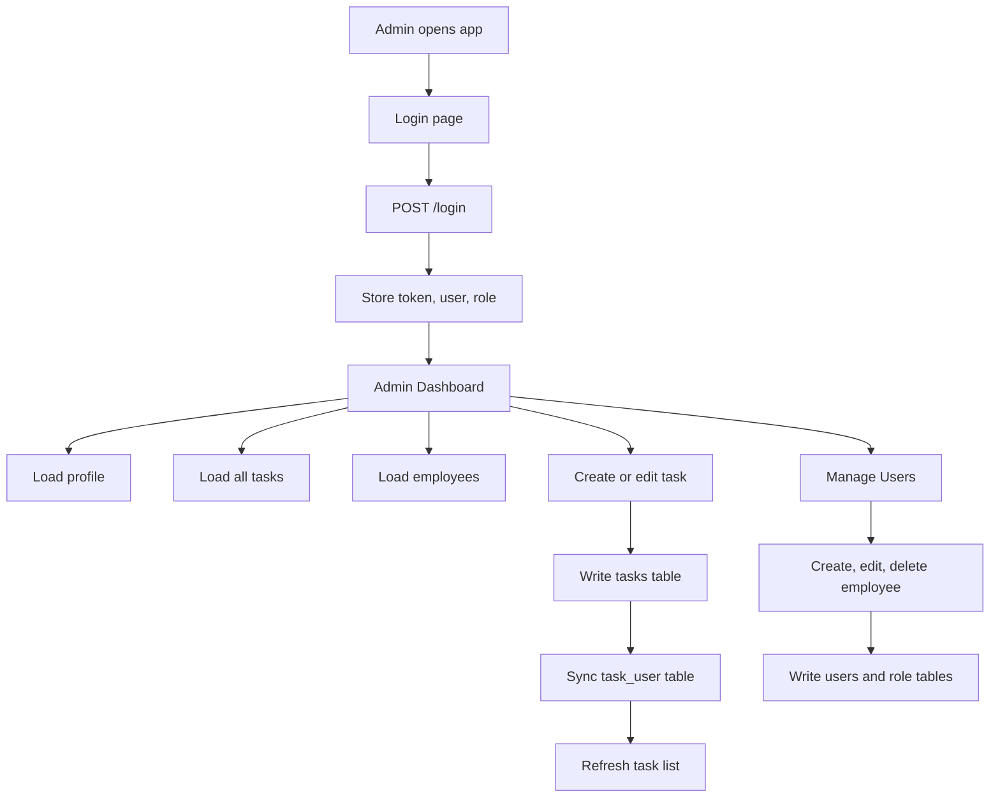
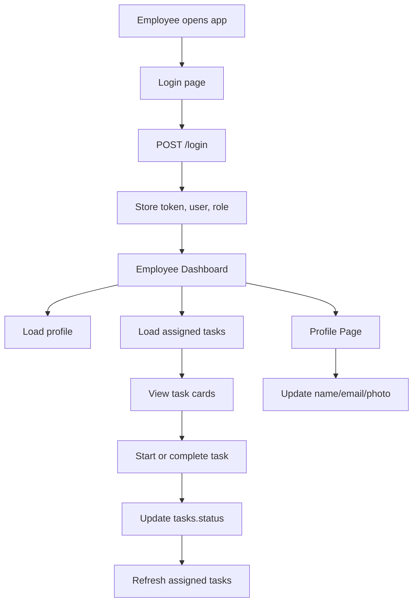

# System Walkthrough Documentation

This document explains how the task manager system works from start to finish: frontend screens, authentication, API requests, backend controllers, database writes, and role-based behavior.

Related docs:

- `docs/API_ENDPOINTS.md`
- `docs/DATABASE_SCHEMA.md`

## System Overview

The project is split into two apps:

| Layer | Folder | Main Technology | Responsibility |
| --- | --- | --- | --- |
| Frontend | `task-manager-frontend` | React, Vite, Material UI, React Query, Axios | User interface, navigation, form submission, cached API data |
| Backend | `task-manager-backend` | Laravel, Sanctum, Spatie Permission, Spatie Media Library | API routes, authentication, authorization, validation, database operations |

The frontend talks to the backend through this API base URL:

```js
http://127.0.0.1:8000/api
```

Defined in:

```txt
task-manager-frontend/src/config/api.jsx
```

## High-Level Architecture



## Main User Roles

The system has two expected roles:

| Role | Main Screens | Main Capabilities |
| --- | --- | --- |
| `admin` | Admin Dashboard, User Management, Profile | Manage tasks, assign tasks to employees, manage employees |
| `employee` | Employee Dashboard, Profile | View assigned tasks, start tasks, complete tasks |

Roles are handled by Spatie Permission in Laravel.

Frontend role behavior:

- React stores the logged-in user's role in `localStorage`.
- React uses that role to decide which dashboard to show.
- `ProtectedRoute.jsx` blocks pages if the stored role does not match the route.

Backend role behavior:

- Laravel uses `auth:sanctum` to require a valid token.
- Laravel uses `role:admin` and `role:employee` middleware to protect role-specific API endpoints.

## Application Startup

Frontend entry file:

```txt
task-manager-frontend/src/main.jsx
```

Startup flow:

1. React mounts the app into `#root`.
2. `QueryClientProvider` wraps the app so React Query can cache API data.
3. `BrowserRouter` wraps the app so React Router can control navigation.
4. `App.jsx` defines the available pages.

Important wrappers:

```jsx
<QueryClientProvider client={queryClient}>
  <BrowserRouter>
    <App />
  </BrowserRouter>
</QueryClientProvider>
```

## Frontend Page Map

Defined in:

```txt
task-manager-frontend/src/App.jsx
```

| URL | Component | Access |
| --- | --- | --- |
| `/` | Redirects to `/login` | Public |
| `/login` | `Login.jsx` | Public |
| `/admin/dashboard` | `AdminDashboard.jsx` | Admin only |
| `/employee/dashboard` | `EmployeeDashboard.jsx` | Employee only |
| `/profile` | `ProfilePage.jsx` | Any logged-in user |
| `/admin/users` | `UserManagement.jsx` | Admin only |

## Frontend Route Protection

Component:

```txt
task-manager-frontend/src/components/ProtectedRoute.jsx
```

How it works:

1. Reads `token` from `localStorage`.
2. Reads `role` from `localStorage`.
3. If there is no token, redirects to `/login`.
4. If the route requires a role and the stored role does not match:
   - Admin users go to `/admin/dashboard`.
   - Other users go to `/employee/dashboard`.
5. If checks pass, the protected page renders.

Important note:

- This protects frontend navigation only.
- Real API security still depends on Laravel Sanctum and role middleware.

## Backend Route Protection

Defined in:

```txt
task-manager-backend/routes/api.php
```

Public API routes:

- `POST /register`
- `POST /login`

Authenticated API routes:

- `POST /logout`
- `GET /profile/{id}`
- `PATCH /profile/{id}`
- `POST /profile/{id}/photo`

Admin-only API routes:

- `GET /users`
- `POST /users`
- `PUT /users/{id}`
- `DELETE /users/{id}`
- `GET /tasks`
- `POST /tasks`
- `PUT /tasks/{id}`
- `DELETE /tasks/{id}`

Employee-only API routes:

- `GET /my-tasks`
- `PATCH /tasks/{id}/status`

## Authentication Walkthrough

Main files:

| File | Purpose |
| --- | --- |
| `Login.jsx` | Login form and login request |
| `AuthController.php` | Backend credential checking and token creation |
| `UserController.php` | Profile data after login |
| `personal_access_tokens` table | Stores Sanctum tokens |

### Login Flow



Step-by-step:

1. User submits the login form in `Login.jsx`.
2. React sends `POST /login` with `email` and `password`.
3. `AuthController@login` validates the request.
4. Laravel looks up the user by email.
5. Laravel checks the submitted password against the hashed password.
6. If valid, Laravel creates a Sanctum token.
7. Laravel returns user data, roles, and token.
8. React calls `GET /profile/{id}` to get complete profile data.
9. React stores:
   - `token`
   - `user`
   - `role`
10. React redirects:
   - `admin` to `/admin/dashboard`
   - `employee` to `/employee/dashboard`

### Login Failure

If credentials are invalid:

1. Laravel returns `401`.
2. React catches the error.
3. React displays `Invalid email or password.`

### Registration Flow

Main file:

```txt
task-manager-frontend/src/components/Register.jsx
```

Step-by-step:

1. User opens `/register` from the login page.
2. React validates name, email, password length, and password confirmation.
3. React sends `POST /register`.
4. `AuthController@register` validates the request.
5. Laravel creates the user, assigns the `employee` role, and creates a Sanctum token.
6. React shows `Registration successful. You can now log in.`
7. React redirects to `/login`.

Important note:

- The `employee` role must already exist before registration, because the controller calls `assignRole('employee')`.

## Admin Dashboard Walkthrough

Main file:

```txt
task-manager-frontend/src/components/AdminDashboard.jsx
```

Backend files:

```txt
task-manager-backend/app/Http/Controllers/TaskController.php
task-manager-backend/app/Http/Controllers/UserController.php
```

Database tables:

- `users`
- `tasks`
- `task_user`
- `roles`
- `model_has_roles`

### Admin Dashboard Initial Load

When an admin opens `/admin/dashboard`, React loads three sets of data:

| Data | API Call | Purpose |
| --- | --- | --- |
| Profile | `GET /profile/{id}` | Shows avatar and user name |
| Tasks | `GET /tasks` | Shows task list and task statistics |
| Users | `GET /users` | Loads employees for assignment dropdowns |

Flow:

1. `ProtectedRoute` confirms there is a token and role is `admin`.
2. `AdminDashboard.jsx` reads `token` and `user` from `localStorage`.
3. React Query loads the admin profile.
4. React Query loads all tasks.
5. `fetchEmployees()` loads all users.
6. React filters users with the `employee` role.
7. Dashboard displays:
   - Total task count
   - Pending task count
   - Completed task count
   - Create Task form
   - Task cards

### Admin Creates a Task



Step-by-step:

1. Admin fills in title, description, status, and assigned employees.
2. React validates that:
   - Title is not empty.
   - Status exists.
   - At least one employee is selected.
3. React sends `POST /tasks`.
4. `TaskController@store` validates the request.
5. Laravel creates a row in `tasks`.
6. Laravel syncs selected employees into `task_user`.
7. React clears the form.
8. React invalidates the `["tasks"]` query.
9. React Query reloads the task list.

### Admin Updates a Task

Flow:

1. Admin clicks `Edit` on a task card.
2. React copies the current task data into edit state.
3. Admin changes fields and clicks `Save`.
4. React validates title, status, and employee assignment.
5. React sends `PUT /tasks/{id}`.
6. `TaskController@update` updates the `tasks` row.
7. Laravel syncs assigned users in `task_user`.
8. React exits edit mode.
9. React invalidates `["tasks"]`.
10. Updated tasks reload.

### Admin Deletes a Task

Flow:

1. Admin clicks `Delete`.
2. Browser shows `window.confirm`.
3. If confirmed, React sends `DELETE /tasks/{id}`.
4. `TaskController@destroy` finds the task.
5. Laravel detaches related users.
6. Laravel deletes the task.
7. Database cascade also removes related `task_user` rows.
8. React invalidates `["tasks"]`.
9. Updated tasks reload.

## User Management Walkthrough

Main file:

```txt
task-manager-frontend/src/components/UserManagement.jsx
```

Backend file:

```txt
task-manager-backend/app/Http/Controllers/UserController.php
```

Database tables:

- `users`
- `roles`
- `model_has_roles`

### User Management Initial Load

When an admin opens `/admin/users`:

1. `ProtectedRoute` confirms role is `admin`.
2. React Query sends `GET /users`.
3. `UserController@index` returns all users with roles.
4. React filters the list to users with the `employee` role.
5. The page displays employee cards.

### Admin Creates an Employee

Flow:

1. Admin enters name, email, and password.
2. React checks that all fields are not blank.
3. React sends `POST /users`.
4. `UserController@store` validates the request.
5. Laravel creates a new `users` row.
6. Laravel hashes the password.
7. Laravel assigns the `employee` role through `model_has_roles`.
8. React clears the form.
9. React invalidates `["users"]`.
10. Employee list reloads.

### Admin Updates an Employee

Flow:

1. Admin clicks `Edit`.
2. React switches the employee card into edit mode.
3. Admin edits name, email, and optionally password.
4. React sends `PUT /users/{id}`.
5. Laravel updates name and email.
6. Laravel updates password only if a non-empty password was submitted.
7. React exits edit mode.
8. React invalidates `["users"]`.

### Admin Deletes an Employee

Flow:

1. Admin clicks `Delete`.
2. Browser asks for confirmation.
3. React sends `DELETE /users/{id}`.
4. Laravel blocks deletion if the user has the `admin` role.
5. Laravel deletes non-admin users.
6. Related `task_user` rows are removed through cascade delete.
7. React invalidates `["users"]`.

## Employee Dashboard Walkthrough

Main file:

```txt
task-manager-frontend/src/components/EmployeeDashboard.jsx
```

Backend file:

```txt
task-manager-backend/app/Http/Controllers/TaskController.php
```

Database tables:

- `users`
- `tasks`
- `task_user`

### Employee Dashboard Initial Load

When an employee opens `/employee/dashboard`:

1. `ProtectedRoute` confirms role is `employee`.
2. React reads `token` and `user` from `localStorage`.
3. React Query sends `GET /profile/{id}`.
4. React Query sends `GET /my-tasks`.
5. `TaskController@myTasks` reads the authenticated user from the Sanctum token.
6. Laravel returns tasks assigned through `task_user`.
7. React calculates:
   - Total assigned tasks
   - Pending tasks
   - Completed tasks
8. React renders the assigned task cards.

### Employee Updates Task Status



Step-by-step:

1. Employee clicks `Start Task` for a pending task or `Complete Task` for an in-progress task.
2. React sends `PATCH /tasks/{id}/status` with the next status.
3. `TaskController@updateStatus` validates the status.
4. Laravel confirms the authenticated employee is assigned to the task.
5. Laravel updates `tasks.status`.
6. React invalidates `["my-tasks"]`.
7. React Query reloads the employee task list.
8. The button becomes disabled for completed tasks.

## Profile Page Walkthrough

Main file:

```txt
task-manager-frontend/src/components/ProfilePage.jsx
```

Backend file:

```txt
task-manager-backend/app/Http/Controllers/UserController.php
```

Database tables:

- `users`
- `media`

### Profile Initial Load

When a logged-in user opens `/profile`:

1. `ProtectedRoute` checks that a token exists.
2. React reads `token`, `user`, and `role` from `localStorage`.
3. React Query sends `GET /profile/{id}`.
4. Laravel returns profile fields and `photo_url`.
5. React fills the name and email form fields.
6. React displays the avatar using `photo_url`.

### User Updates Profile Details

Flow:

1. User edits name, email, and optionally password.
2. User clicks `Save Changes`.
3. React checks password length and confirmation when a new password is entered.
4. React sends `PATCH /profile/{id}`.
5. `UserController@updateProfile` validates the request.
6. Laravel updates the `users` row.
7. React updates `localStorage.user`.
8. React clears the password fields.
9. React invalidates `["profile", user.id]`.
10. Profile data reloads.

### User Uploads Profile Photo

Flow:

1. User chooses an image file.
2. User clicks `Upload Photo`.
3. React creates `FormData` and appends the file as `photo`.
4. React sends `POST /profile/{id}/photo`.
5. Laravel validates that the file is an image up to 2048 KB.
6. Laravel clears the existing `profile_photo` media collection.
7. Laravel stores the new image.
8. Laravel returns the new `photo_url`.
9. React updates `localStorage.user.photo_url`.
10. React invalidates the profile query.

### Back Button Behavior

The profile page sends users back based on `localStorage.role`:

- `admin` goes to `/admin/dashboard`.
- Any other role goes to `/employee/dashboard`.

## React Query Cache Walkthrough

React Query reduces manual data loading and refreshes updated data after mutations.

| Query Key | Loaded In | Stores | Invalidated When |
| --- | --- | --- | --- |
| `["profile", user.id]` | Admin dashboard, Employee dashboard, Profile page | Current user's profile | Profile update or photo upload |
| `["tasks"]` | Admin dashboard | All tasks with assigned users | Task create, update, delete |
| `["my-tasks"]` | Employee dashboard | Logged-in employee's assigned tasks | Employee updates task status |
| `["users"]` | User management | All users with roles | Employee create, update, delete |

Typical mutation pattern:

1. React sends a POST, PUT, PATCH, or DELETE request.
2. Backend validates and changes the database.
3. React shows success or error message.
4. React invalidates the affected query key.
5. React Query refetches fresh data.

## Data Model Walkthrough

The central business data is simple:



### User Data

Stored in `users`.

Used for:

- Login
- Profile display
- Employee accounts
- Admin accounts
- Task assignment

### Role Data

Stored in:

- `roles`
- `model_has_roles`

Used for:

- Backend middleware checks
- Frontend dashboard redirect
- Admin-only and employee-only pages

### Task Data

Stored in:

- `tasks`
- `task_user`

Used for:

- Admin task list
- Employee assigned task list
- Task statistics
- Assignment between tasks and employees

### Token Data

Stored in:

- `personal_access_tokens`

Used for:

- Bearer-token API authentication.

### Profile Photo Data

Stored in:

- `media`
- File storage disk

Used for:

- Dashboard avatars
- Profile page avatar

## Complete Admin Journey



Admin can:

- View all tasks.
- Create tasks.
- Assign tasks to employees.
- Edit tasks.
- Delete tasks.
- Create employee accounts.
- Edit employee accounts.
- Delete employee accounts.
- Update own profile.
- Upload own profile photo.

## Complete Employee Journey



Employee can:

- View assigned tasks.
- See task counts.
- Start assigned tasks and mark in-progress tasks as completed.
- Update own profile.
- Upload own profile photo.

## Error Handling Walkthrough

Frontend error handling is component-level.

Examples:

| Area | Failure | React Message |
| --- | --- | --- |
| Login | Invalid credentials | `Invalid email or password.` |
| Admin tasks | Create fails | `Failed to create task.` |
| Admin tasks | Update fails | `Failed to update task.` |
| Admin tasks | Delete fails | `Failed to delete task.` |
| Employee tasks | Status update fails | `Failed to update task status.` |
| Profile | Profile load fails | `Failed to load profile.` |
| Profile | Profile update fails | `Failed to update profile.` |
| Profile | Photo upload fails | `Failed to upload profile photo.` |
| Users | Employee load fails | `Failed to load employees.` |
| Users | Employee create fails | `Failed to create employee.` |
| Users | Employee update fails | `Failed to update employee.` |
| Users | Employee delete fails | `Failed to delete employee.` |

Backend error handling mostly comes from:

- Laravel validation errors.
- `findOrFail()`, which returns a 404 when records are missing.
- Role middleware, which blocks unauthorized role access.
- Sanctum middleware, which blocks unauthenticated requests.

## Current Logout Behavior

Current React behavior:

1. User clicks `Logout`.
2. React sends `POST /logout` with the bearer token.
3. Laravel deletes the current Sanctum token with `currentAccessToken()->delete()`.
4. React clears all `localStorage`.
5. React navigates to `/login`.

## Fresh Install Expectations

For the system to work after migrations:

1. Database tables must exist.
2. Spatie roles should exist:
   - `admin`
   - `employee`
3. At least one admin user should exist.
4. The admin user should have the `admin` role.
5. Laravel backend should run on `http://127.0.0.1:8000`.
6. React frontend should use `http://127.0.0.1:8000/api` as the API base URL.

Current seeder note:

- `DatabaseSeeder.php` creates the `admin` and `employee` roles.
- It creates `admin@test.com`, `employee@test.com`, and `employee2@test.com`.
- All seeded users use `password123`.

## Known System Risks and Improvement Areas

These are not blockers for understanding the system, but they are worth knowing:

- Frontend route protection depends on `localStorage`, which users can edit. Backend middleware is the real security layer.
- `task_user` has no database-level unique constraint on `(task_id, user_id)`.
